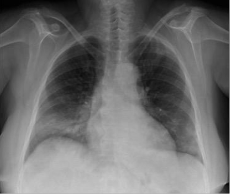
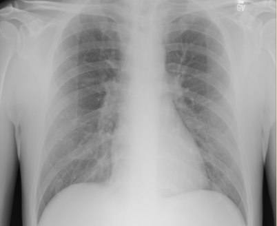
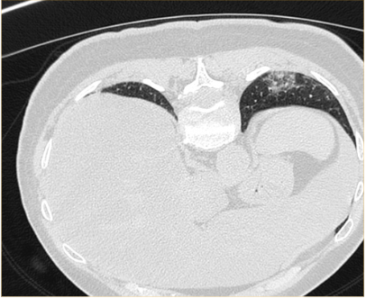
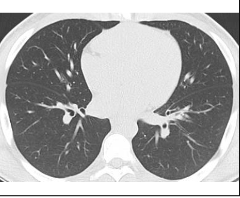
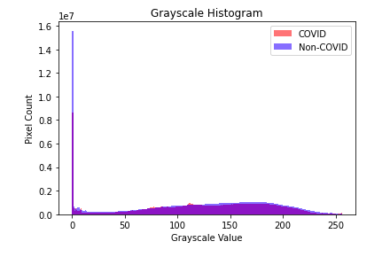
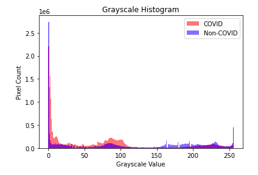

# COVID-image-classification
COVID-image-classification

## Business and Data Understanding:

Stakeholders: 
- Medical professionals (e.g. doctors, nurses, radiologists) 
- Implement the algorithm into a user-friendly tool for medical professionals to easily upload X-ray images and receive a classification of COVID-19 or not
- Work with medical institutions, hospitals, and clinics to market and distribute the tool to areas with limited access to PCR testing or where PCR tests are not immediately available
- COVID-19 has infected over 400 million people and caused more than 5 million deaths worldwide as of March 2023. Source: World Health Organization

Business objectives:
- PCR testing, which is the most reliable diagnostic method for COVID-19, may not be readily available in some areas, leading to delayed diagnosis and treatment.
- For institutions with access to X-Ray or CT, develop an accurate model to predict COVID-19 based on image classification

## Data understanding:
-  The dataset contains X-ray and CT images of both Non-COVID and COVID cases.
The dataset has been augmented with different techniques to generate approximately 17,099 images. There are two main folders in the dataset, one for X-ray images and the other for CT images.
- The X-ray folder contains two sub-folders of 5,500 Non-COVID images and 4,044 COVID images.The CT folder also contains two sub-folders of 2,628 Non-COVID images and 5,427 COVID images.
- The dataset was published on June 12, 2020, and is currently in Version 3. The contributors to the dataset are Walid El-Shafai and Fathi E. Abd El-Samie. https://data.mendeley.com/datasets/8h65ywd2jr 

## Exploring the data

Chest X-rays can be used to assess the severity of COVID-19 in some cases. COVID-19 can cause pneumonia, and a chest X-ray can show the extent of lung involvement. A typical chest X-ray in a COVID-19 patient may show patchy or diffuse areas of hazy opacity in the lungs.

Here is an example of a COVID-positive X-Ray:

 

Here is an example of a COVID-negative X-Ray:

 

COVID-19 can cause pneumonia, and a CT scan of the chest can show the extent of lung involvement. A typical CT scan of the chest in a COVID-19 patient may show ground-glass opacities, which appear as hazy areas in the lungs. These opacities may be patchy or diffuse and may involve multiple lobes of the lung.

Here is an example of a COVID-negative CT scan:

 

Here is an example of ea COVID-positive CT scan:

 

In both X-Ray and CT scan, the distribution of grayscale values slightly deviate from each other for COVID vs. Non-COVID images:

 

 

We can see that CT scans have a bit starker of a distribution than for X-Rays between positive and negative cases, suggesting that it might be easier for CT imaging models to distinguish between the two binary classes. Additionally, we can see that for all image types, the grayscale value of 0 (white) is prevalent across the board, meaning that there are a lot of white pixels and could potentially add to difficulty in selecting between the classes.

Note that because our stakeholders want to avoid false negatives, we will be optimizing for recall while also keeping accuracy as an additional key meric. 

## Modeling

- Baseline model: This model has two convolutional layers with 32 and 64 filters respectively, followed by a dense layer with 16 units and a sigmoid output layer. It uses a batch size of 64 and an early stopping callback with a minimum delta of 1e-2 and patience of 5. The loss function is 'binary_crossentropy'.

- Model 1: This model is similar to the baseline model, but has an additional MaxPooling2D layer after the second convolutional layer, and a dense layer with 64 units before the output layer. It uses a batch size of 32 and trains for 10 epochs with no early stopping.

- Model 2: This model is also similar to the baseline model, but has L2 regularization with a weight of 0.01 on the weights of the second and third convolutional layers, and the dense layer before the output layer. It uses a batch size of 32 and trains for 10 epochs with no early stopping. Additionally, it tracks precision and recall as additional metrics.

- Model 3: This model has a more complex architecture, with four convolutional layers, each with 32 or 64 filters, followed by two dense layers with 256 units each, and a sigmoid output layer. It uses a batch size of 32 and trains for 20 epochs with no early stopping. The loss function is 'binary_crossentropy' and the optimizer is 'Adam'.

- Model 4: Updated the learning rate of Adam optimizer to .01.

- Model 4: Updated learning rate of Adam optimizer to .001 and updated filters for dense layer from 32 to 64.

## Evaluation

CT results:

- Model 1 (baseline): Test accuracy: 0.657 No additional metrics reported
- Model 2: Test accuracy: 0.917 No additional metrics reported
- Model 3: Test accuracy: 0.857 Test precision: 0.717 Test recall: 0.964
- Model 4: Test accuracy: 0.903 Test precision: 0.890 Test recall: 0.817
- Model 5: Test accuracy: 0.903 Test precision: 0.890 Test recall: 0.817

Additional test accuracy reported after training on more epochs: 0.917 Based on our criteria of selecting the model with the highest recall, Model 3 has the highest recall score of 0.964. However, if we also consider test accuracy and precision, then Model 4 would also be a good choice as it has a slightly lower recall score of 0.817, but higher accuracy and precision scores, so we are going with model 4. Note that Model 5 has the same metrics as Model 4 except for the additional test accuracy reported after training on more epochs, so we may also consider this model.

X-Ray results:

## Conclusions and recommendations

- CT scan is better at predicting COVID than X-Ray
- Model can still be useful for a generalization of risk, but probably not ideal for diagnosis
- Look at differences between pneumonia and COVID positive images to see if we can improve accuracy be combining these models
- Further improvements can be implemented with additional layers in the neural net, data augmentation or additional hyper-parameter tuning

